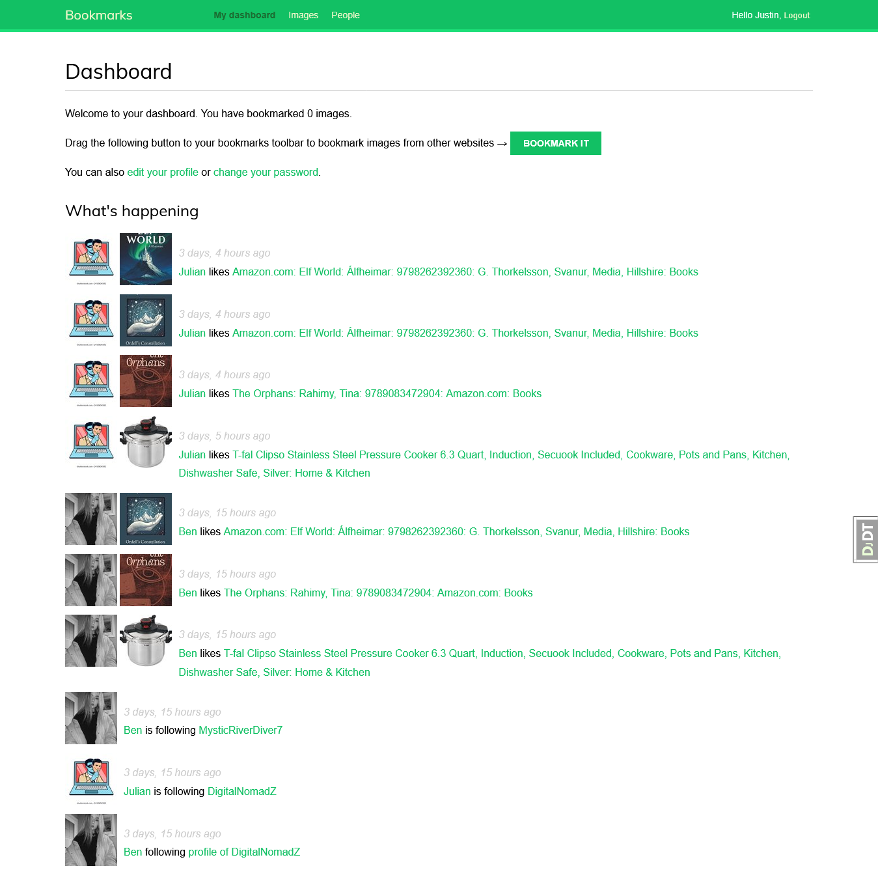
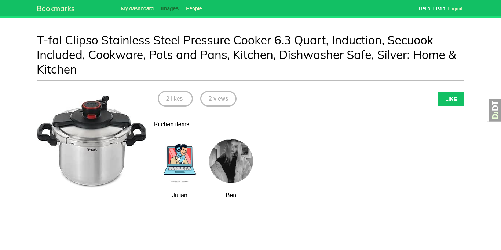
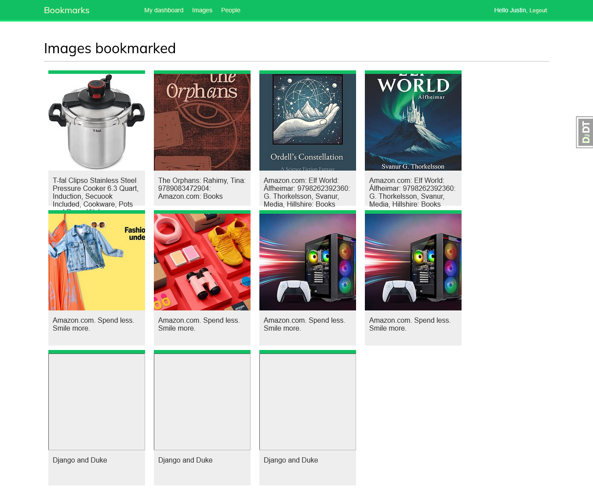
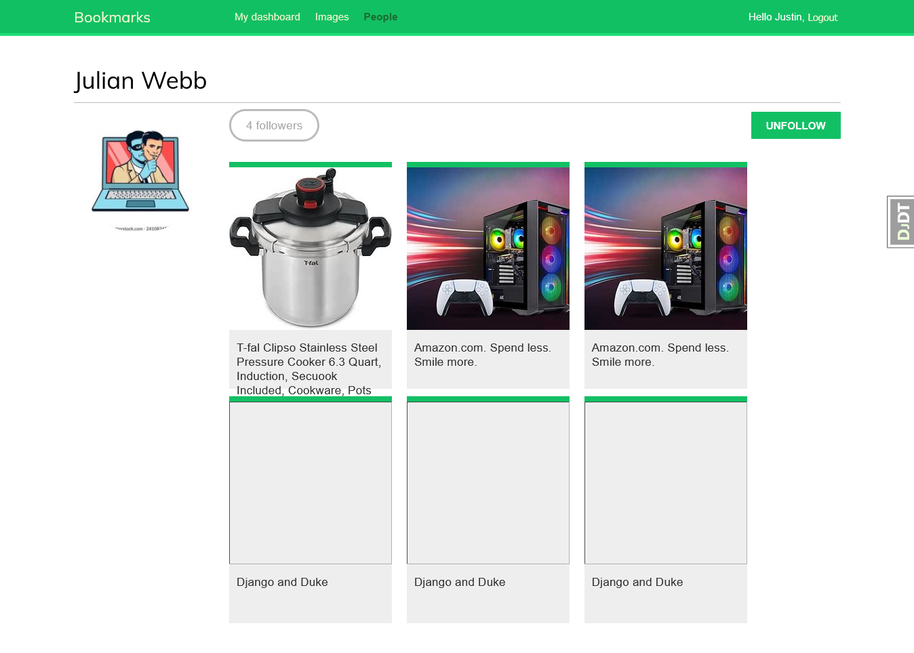
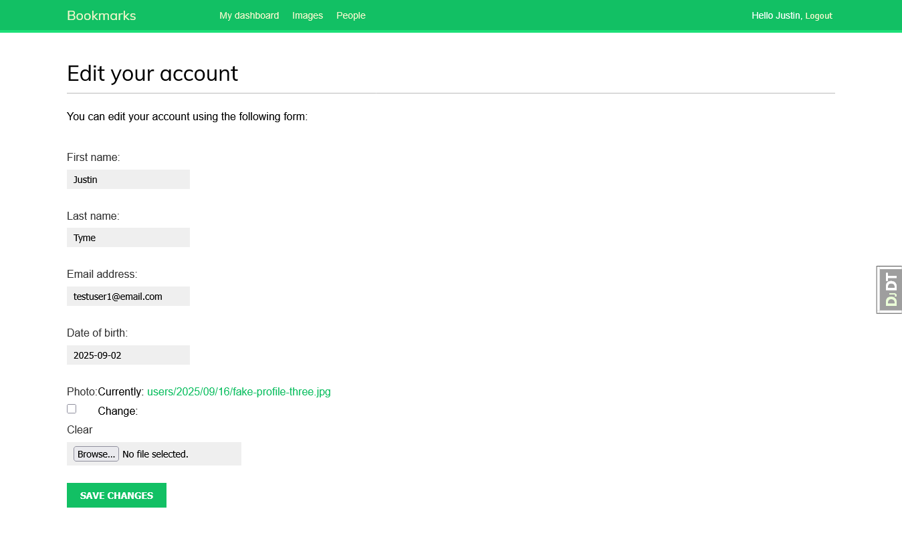
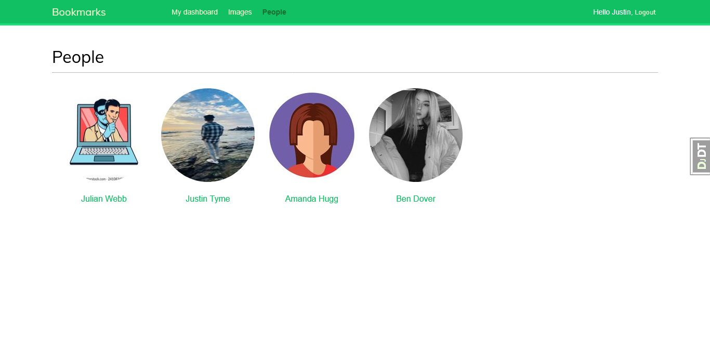
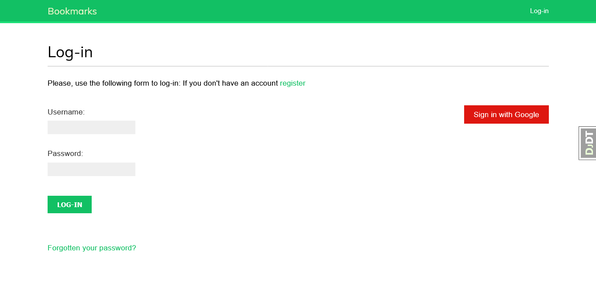
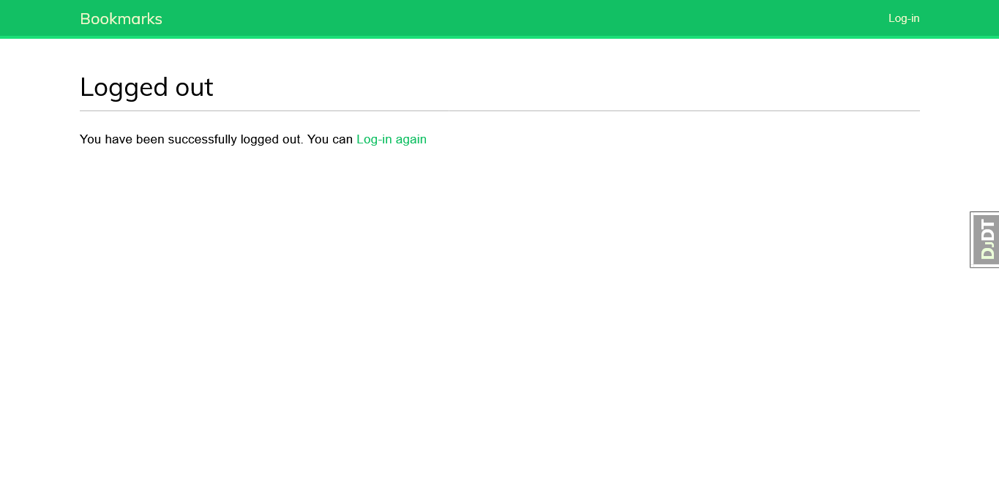
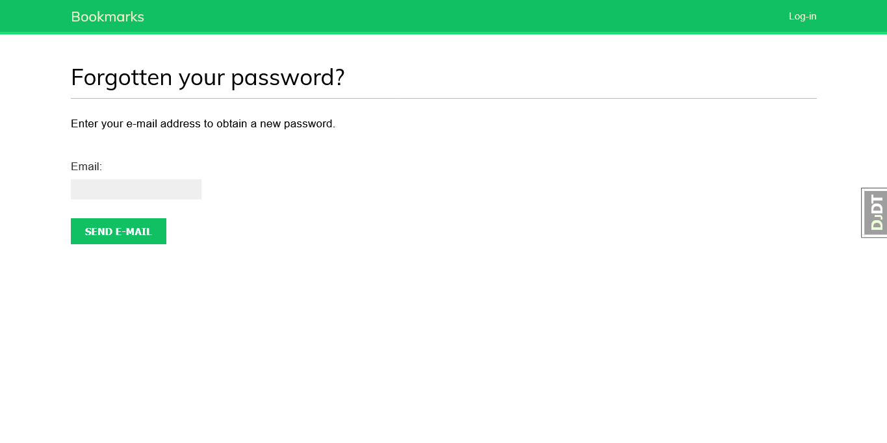
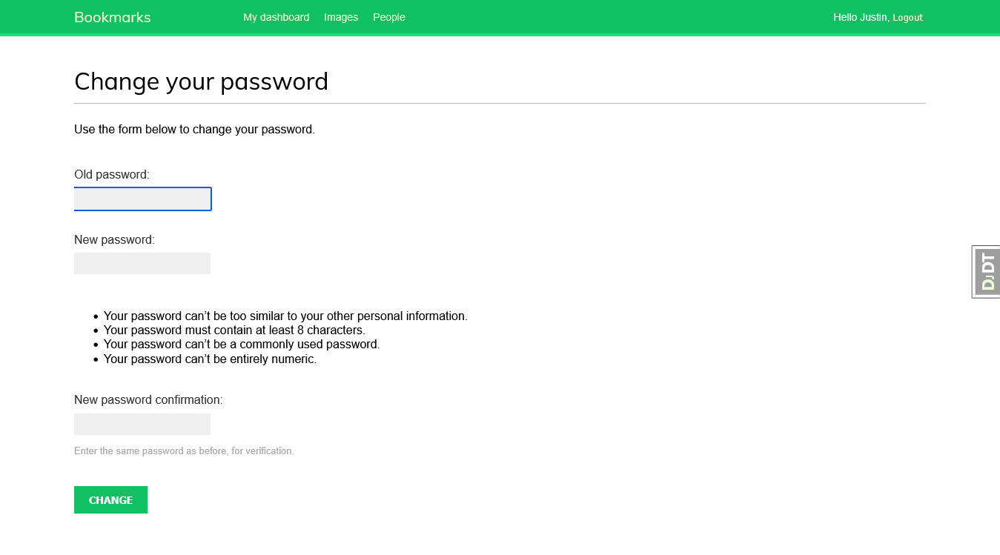

## Bookmark Network

Bookmark Network is a Django-based social platform designed for organizing, sharing, and discovering bookmarks and images. Users can create accounts, save and categorize bookmarks, upload images, and interact with others through likes and follows. The app features real-time view counts powered by Redis, seamless endless scrolling for shared content, and robust user authentication. Its modular structure supports easy extension and customization, making it suitable for both personal use and collaborative sharing within communities.
### Features

- **User Following:** Connect with other users, follow their activity, and view bookmarks they share.
- **Likes:** Express appreciation by liking images and bookmarks.
- **Real-Time View Counts:** Track image popularity with live view counts powered by Redis.
- **Authentication & Registration:** Secure user sign-up, login, and password management.
- **Bookmark Management:** Save, categorize, and share bookmarks with the community.
- **Image Uploads:** Upload, organize, and share images alongside bookmarks.
- **Social Interactions:** Engage with others through likes, follows, and shared content.
- **Endless Scrolling:** Seamlessly browse shared bookmarks and images with infinite scroll.

### Getting Started

1. **Clone the Repository:**
    ```bash
    git clone https://github.com/yourusername/bookmark_network.git
    cd bookmark_network
    ```
2. **Install Dependencies:**
    ```bash
    pip install -r requirements.txt
    ```
3. **Apply Migrations:**
    ```bash
    python manage.py migrate
    ```
4. **Start the Development Server:**
    ```bash
    python manage.py runserver
    ```
5. **Access the App:**  
    Open your browser and navigate to `http://127.0.0.1:8000/`.

### Project Structure

- `account/` — Handles user registration, authentication, and profile management.
- `actions/` — Manages social actions such as likes and follows.
- `images/` — Supports image uploads, organization, and sharing.
- `bookmarks/` — Core app for bookmark creation, categorization, and sharing.

### License

This project is licensed under the MIT License.

### Screenshots

Below are example screenshots showcasing key features of Bookmark Network:

#### Home Feed


#### Bookmark Detail


#### Image Gallery


#### Additional Screenshots

Below are more screenshots from the `screenshots/` directory:










Screenshots are located in the `screenshots/` directory.
